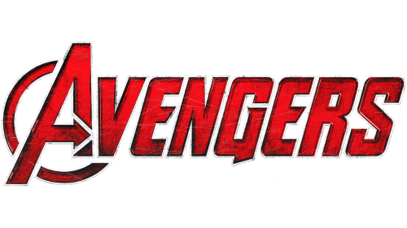

# ReQuestHub - Mission Management Platform



## 🦸‍♂️ Welcome to the Avengers' Mission Control Center! 🦸‍♀️

**ATTENTION, EARTH'S MIGHTIEST HEROES!**

The multiverse is in chaos, and only you can save it! RequestHub is your ultimate mission management platform, designed by Tony Stark himself to coordinate your superhero activities across dimensions. Whether you're fighting Thanos, battling Kang the Conqueror, or just need to request a new suit upgrade, this platform has got you covered!

### What You Can Do With RequestHub:

- **Mission Planning**: Create and manage missions with detailed parameters, threat levels, and team assignments
- **Resource Management**: Request specialized equipment, weapons, and tech upgrades for your missions
- **Team Coordination**: Assign the right heroes to the right missions based on their powers and availability
- **Mission Tracking**: Monitor mission progress and receive real-time updates from the field
- **Intelligence Gathering**: Upload and analyze evidence from your missions to identify threats
- **Mission Briefings**: Generate comprehensive mission reports for S.H.I.E.L.D. and the Avengers Council

Remember, with great power comes great responsibility... and a well-organized mission management system! 

---

## 🚀 Project Overview

reQuestHub is a modern, front-end mission management platform built with React and TypeScript. While themed around the Marvel universe, it demonstrates enterprise application capabilities including complex state management, role-based access control, and responsive design patterns.

## 🛠️ Technical Stack

- **Frontend Framework:** React 18 with TypeScript
- **State Management:** Zustand with persistence middleware
- **UI Components:** React Bootstrap with custom theming
- **Form Handling:** React Hook Form
- **Routing:** React Router v6 with protected routes
- **Styling:** SCSS with responsive design
- **Charts & Visualizations:** React-Circular-Progressbar
- **Icons:** React Icons (Feather)
- **Build Tool:** Vite for optimal development experience
- **Additional Libraries:** React-Quill, React-Use-Wizard, Swiper

## 🌟 Key Technical Features

### Architecture & Design Patterns
- **Component Composition:** Modular, reusable components
- **Type Safety:** TypeScript interfaces for data models
- **Responsive Design:** Mobile-first approach with breakpoint-specific layouts
- **State Management:** Zustand stores for theme and user data with persistence

### Advanced Features
- **Wizard Navigation:** Multi-step form process with state persistence
- **Dashboard Analytics:** Visual representation of mission data
- **Form Validation:** Client-side validation
- **Mission Management:** Create, view, and manage missions
- **Theme Switching:** Dark/light mode with persistent user preference

### Security & Authentication
- **Role-Based Access:** Different views for different roles
- **Secure Routing:** Protected routes with authentication checks

## 🎮 Demo Features

### Mission Management
- Create and track missions
- Assign heroes based on skills and availability
- Monitor mission progress
- Generate mission reports

### Team Organization
- Manage different superhero teams
- Track team composition and operational status
- Coordinate between teams

### Resource Allocation
- Request and manage specialized equipment
- Track inventory of advanced technology
- Coordinate with suppliers and facilities

## 🚀 Getting Started

```bash
# Clone the repository
git clone https://github.com/hkgonebad/request-hub.git

# Install dependencies
bun install

# Start development server
bun dev

# Build for production
bun build
```

## 🌐 Live Demo

Visit our live demo at: [https://hkgonebad.github.io/request-hub/](https://hkgonebad.github.io/request-hub/)

## 🤝 Contributing

We welcome contributions to reQuestHub! Whether you want to add new features, fix bugs, or improve documentation, your help is appreciated.

### How to Contribute

1. **Fork the repository** to your GitHub account
2. **Clone your fork** to your local machine
3. **Create a new branch** for your feature or bugfix
4. **Make your changes** and commit them with clear, descriptive commit messages
5. **Push your branch** to your fork
6. **Open a Pull Request** from your fork to the `development` branch of the main repository

### Branch Structure

- **main**: Production-ready code
- **development**: Integration branch for features and bugfixes

### Development Workflow

1. All new features and bugfixes should be developed in feature branches
2. Pull requests should be made to the `development` branch
3. After review and testing, changes will be merged to `development`
4. Periodically, `development` will be merged to `main` for releases

### Project Roadmap

- [ ] Backend integration with RESTful API
- [ ] Real-time mission updates using WebSockets
- [ ] Advanced mission analytics and reporting
- [ ] Mobile app version using React Native
- [ ] Integration with S.H.I.E.L.D. databases

## 📱 Responsive Design

The application is fully responsive and optimized for all available devices in the Multiverse before Dr. Doom.

## 🎨 UI/UX Highlights

- Modern, clean interface
- Intuitive navigation
- Consistent design language
- Responsive layouts
- Interactive components

## 📝 License

This project is licensed under the MIT License - see below for details:

```
MIT License

Copyright (c) 2024 RequestHub

Permission is hereby granted, free of charge, to any person obtaining a copy
of this software and associated documentation files (the "Software"), to deal
in the Software without restriction, including without limitation the rights
to use, copy, modify, merge, publish, distribute, sublicense, and/or sell
copies of the Software, and to permit persons to whom the Software is
furnished to do so, subject to the following conditions:

The above copyright notice and this permission notice shall be included in all
copies or substantial portions of the Software.

THE SOFTWARE IS PROVIDED "AS IS", WITHOUT WARRANTY OF ANY KIND, EXPRESS OR
IMPLIED, INCLUDING BUT NOT LIMITED TO THE WARRANTIES OF MERCHANTABILITY,
FITNESS FOR A PARTICULAR PURPOSE AND NONINFRINGEMENT. IN NO EVENT SHALL THE
AUTHORS OR COPYRIGHT HOLDERS BE LIABLE FOR ANY CLAIM, DAMAGES OR OTHER
LIABILITY, WHETHER IN AN ACTION OF CONTRACT, TORT OR OTHERWISE, ARISING FROM,
OUT OF OR IN CONNECTION WITH THE SOFTWARE OR THE USE OR OTHER DEALINGS IN THE
SOFTWARE.
```

---

*"In a world of chaos, organization is our greatest weapon." - Nick Fury*
